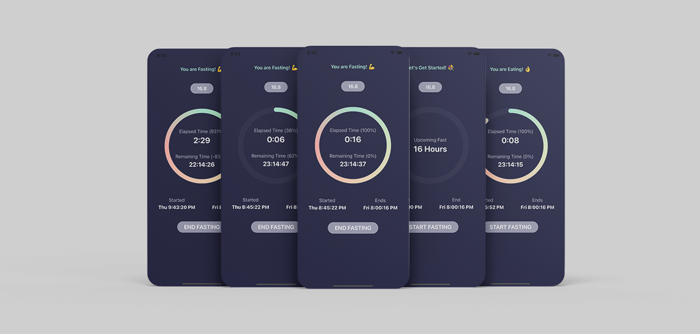
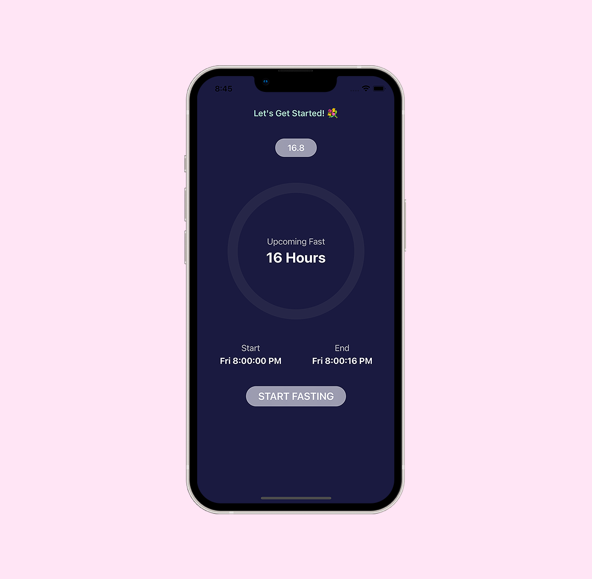
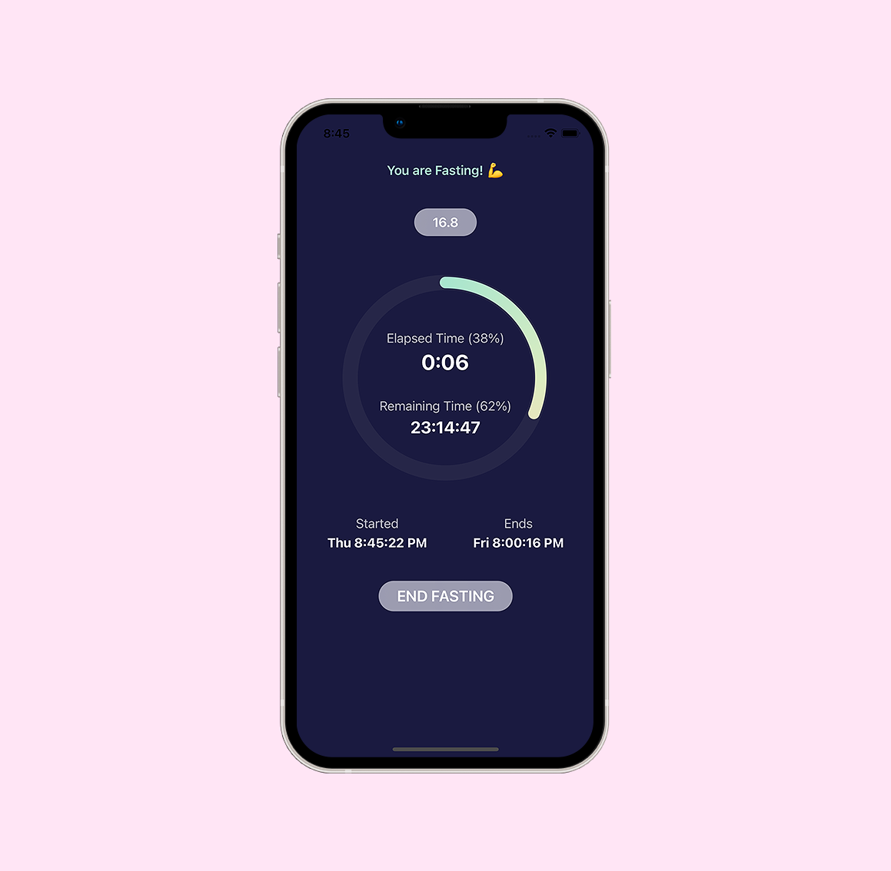
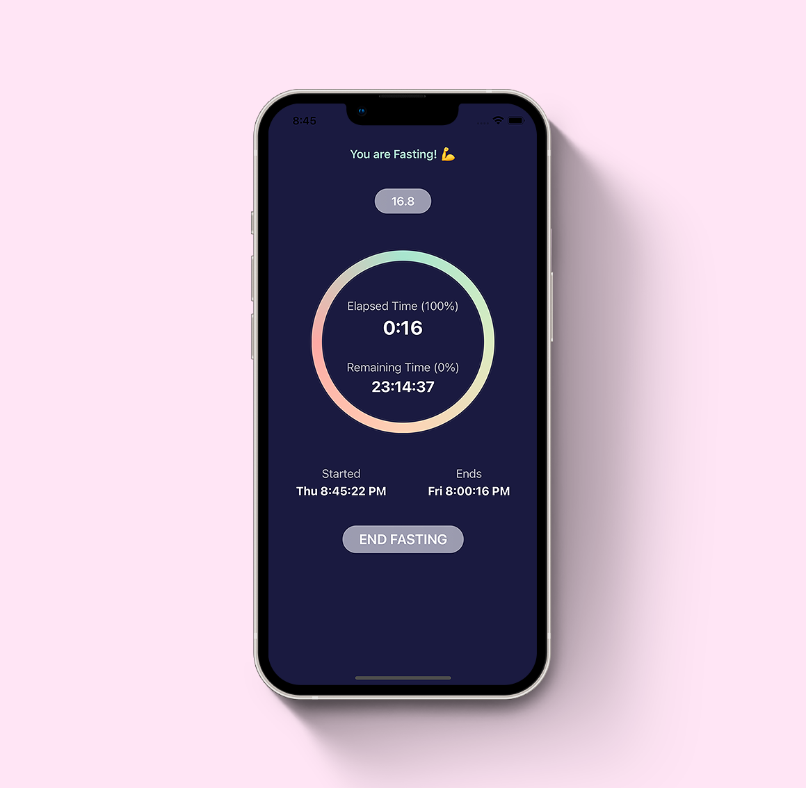
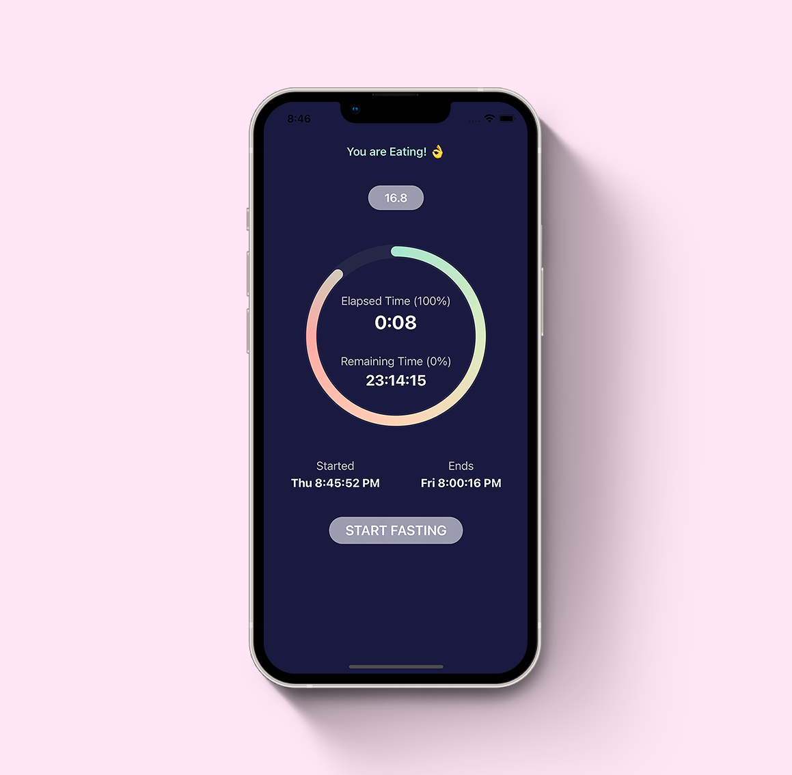

# Fasting Tracker

Fasting Tracker iOS app concept using SwiftUI 3.0 🥳


[](https://opensource.org/licenses/Apache-2.0)
[](https://github.com/shameemreza/FastingTracker/blob/main/LICENSE)

## Video Preview

[](https://youtu.be/qf1Som7fT3U "FastingTracker")


## Screenshots







## Features

* Dates components
* Count up and count down timers
* Progress Calcualtion
* Progress Circle with animation
* Scheduling date with calendar date components
* Tracking time with timer publisher
* Calculate progress from timer and display in progress circle

Dribble Shot 👉 [Click Here](https://dribbble.com/shots/17888945-Fasting-Tracker-App-UI)

## License

```
Copyright 2022 Shameem Reza

Licensed under the Apache License, Version 2.0 (the "License");
you may not use this file except in compliance with the License.
You may obtain a copy of the License at

   http://www.apache.org/licenses/LICENSE-2.0

Unless required by applicable law or agreed to in writing, software
distributed under the License is distributed on an "AS IS" BASIS,
WITHOUT WARRANTIES OR CONDITIONS OF ANY KIND, either express or implied.
See the License for the specific language governing permissions and
limitations under the License.
```

